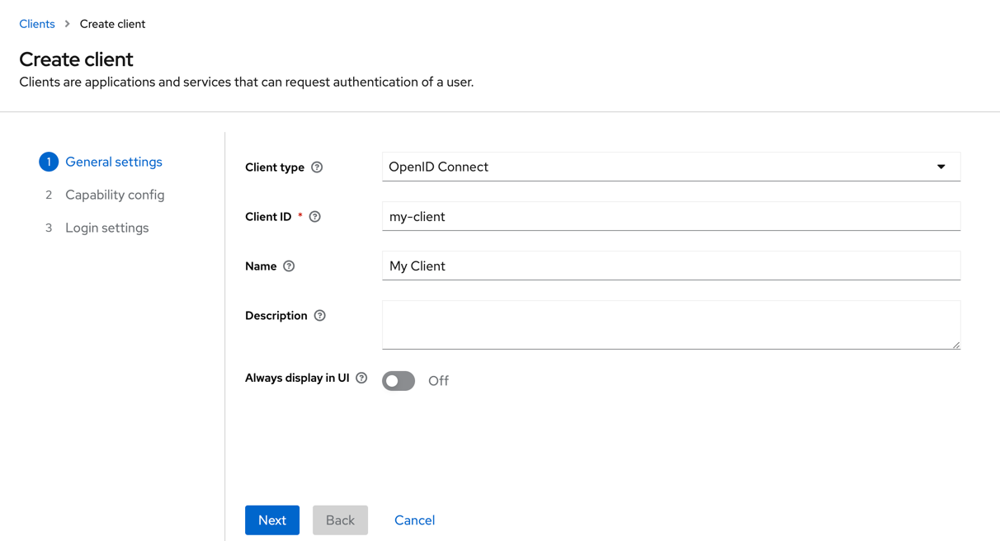
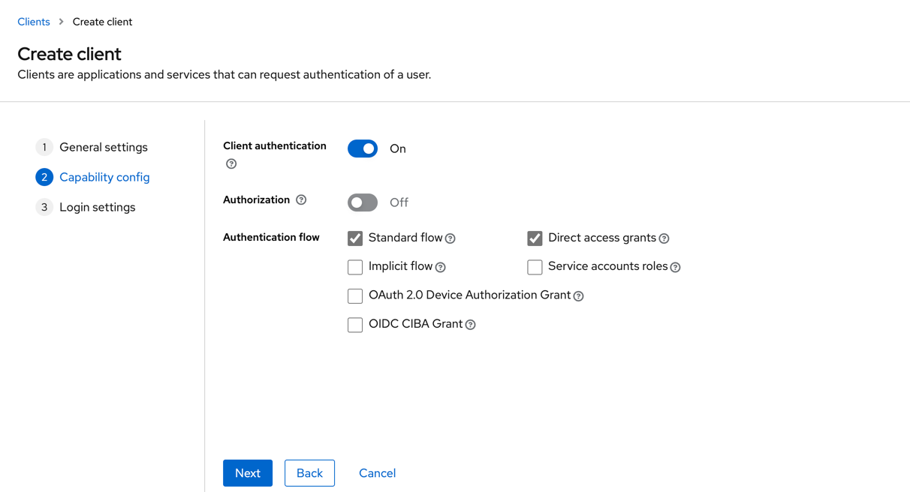
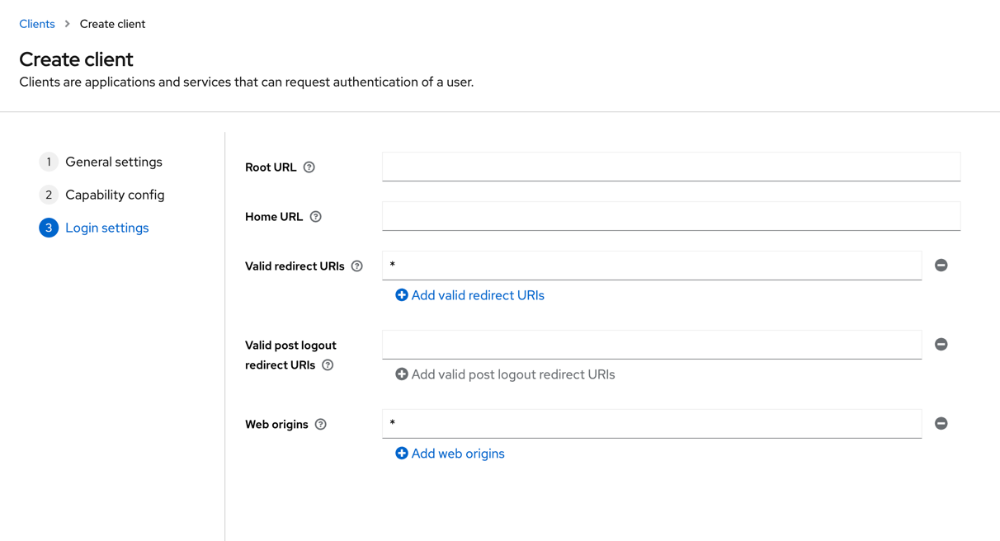

# NuxtAuth Example

## Setup
This example app uses the NuxtAuth module. You can find the docs [here](https://auth.sidebase.io/) for further explanation.
### Preparing Keycloak
Start up the docker containers by running
```bash
docker compose up
```
Open your browser and head to [localhost:8080/auth](http://localhost:8080/auth) and sign in with the admin credentials.
> Username: admin \
> Password: password

Create a new realm and name it "test-realm". \
Inside the new realm create a new client as shown below and hit "Save" afterward.



Inside the "Credentials" tab you can find the "Client Secret". You'll need the Client ID and the Client Secret later in this guide.

Now you need to create a user, just name it "user". Head to the "credentials" tab of the user and set a non-temporary password like "password".

And that's it. Now we configure the Nuxt app.
### Getting the Nuxt app ready
Install all necessary dependencies
```bash
# If you're using yarn
yarn install

# If you're using npm
npm install
```
Create an .env file in the project root as seen below. You need to paste in the Client Secret from earlier.
```.dotenv
NUXT_AUTH_ORIGIN="http://localhost:3000"
NUXT_AUTH_SECRET="..."
NUXT_AUTH_KEYCLOAK_CLIENT_ID="my-client"
NUXT_AUTH_KEYCLOAK_CLIENT_SECRET="..."
NUXT_AUTH_KEYCLOAK_ISSUER="http://localhost:8080/auth/realms/test-realm"
```
Now you can start up the app.
```bash
# If you're using yarn
yarn dev

# If you're using npm
npm run dev
```
